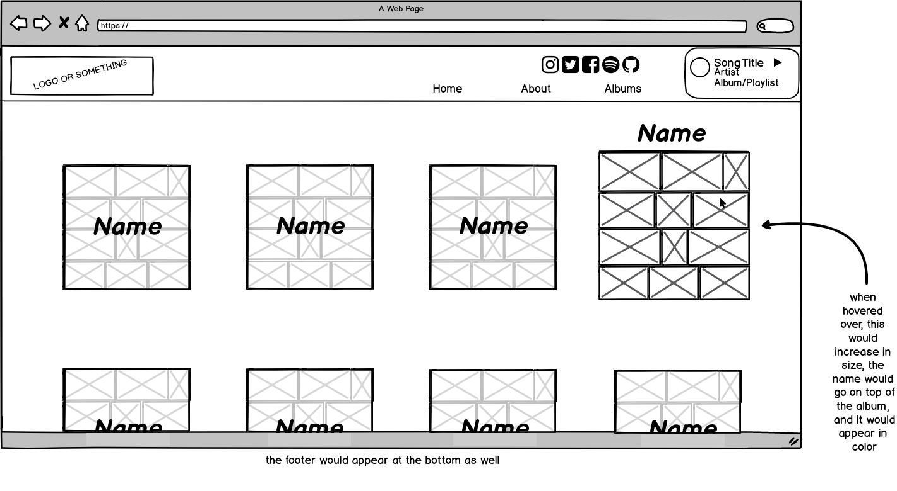
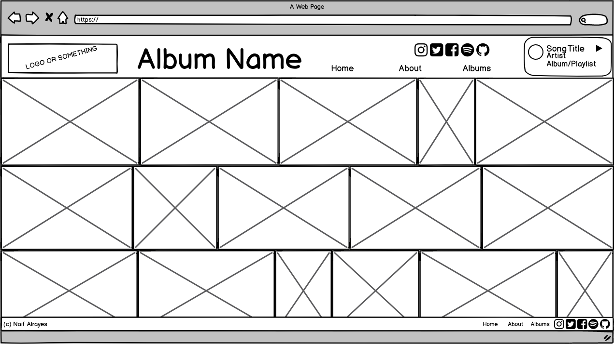
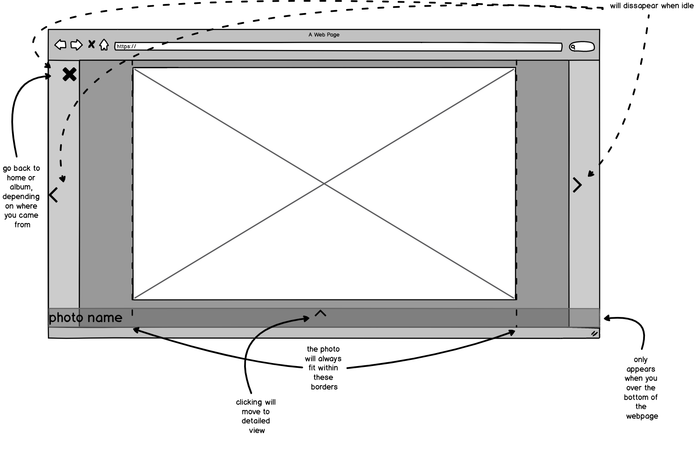
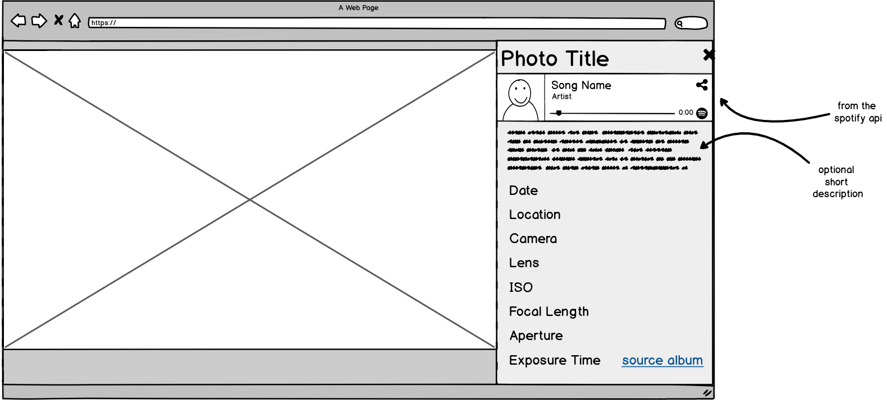
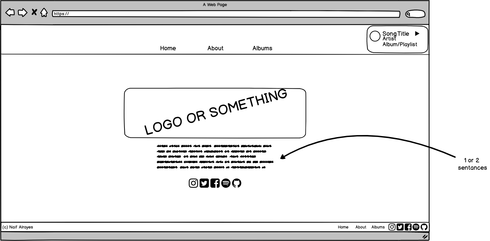
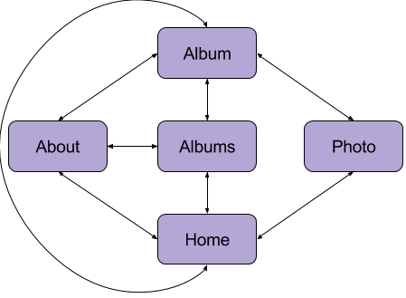

# Photography Site

## Overview

Photography is becoming a favorite hobby of mine, so here's this site that allows me to show off the work I've done! One thing though: I get a lot of inspiration in my photography and editing from music, so each photo is named after and subsequently linked to a song on Spotify. 

God bless.

## Data Model

The application will store Photos, Albums, Locations, and Songs.

* photos have all the technical details about them, a title, and one linked song, one linked album, one linked location, as well as an endpoint where the picture will be stored.
* albums will have a list of photos by id, and a title.
* songs have a title, artist, album, link for the spotify api, and at least one linked photo.
* locations have a name, city, state, and country

An Example Photo:

```javascript
{
  _id: "1";
  name: "IMG_8209",
  title: "gravity eyelids",
  date: Date("2017-07-01"),
  location_id: "1",
  location_string: "Sutro Baths, San Fransisco, CA, USA",
  camera: "Canon Rebel T6i",
  lens: "Canon 18-135mm f/3.5-5.6 IS STM",
  ISO: 100,
  focal_length: 18.0,
  aperture: "f/5.0",
  exposure_time: "1/250 sec",
  source_album_id: "1",
  source_album_name: "SF",
  song_id: "1", // no song name, since all the details would come from the spotify api
  endpoint: "/photos/1.jpg",
}
```

An Example Album:

``` javascript
{
  _id: "1",
  album_name: "SF",
  list_of_photo_ids: [
    "1",
    "2",
    "3",
    "4",
  ],
  album_endpoint_name: "SF", 
}
```

An Example Song:


```javascript
{
  _id: "1",
  url: "https://api.spotify.com/v1/tracks/2dAYkfqPYzOTDNxDDVP2vi",
  track_id: "2dAYkfqPYzOTDNxDDVP2vi",
  title: "Gravity Eyelids",
  album: "In Abstentia",
  artist: "Porcupine Tree",
  linked_photo_ids: ["1"],
}
```

An Example Location:

```javascript
{
  _id: "1",
  name: "Sutro Baths",
  country: "USA",
  city: "San Fransisco",
  state: "CA",
}
```


## [Link to Commented First Draft Schema](db.js) 

(___TODO__: create a first draft of your Schemas in db.js and link to it_)

## Wireframes

/ - home page that includes a specific set of photos


/albums - page for showing all albums



/albums/{album_endpoint_name} - page for showing specific album



/photos/{photo_id} - page for showing specific photo


detailed view of the same page, that includes all the photo information


/about - about page


## Site map



## User Stories or Use Cases

1. as a user, I can register browse through photos
2. as a user, I can listen to the song associated with a photo

## Research Topics

* (5 points) Use React as a frontend framework
    * I'm going to use react to create a hopefully beautiful webpage
    * This is my first time dealing with a frontend framework, with limited knowledge of html and css. 
    * I'm using react since, based on my readings online, it is relatively easy to learn, widely used, and efficient. 
    * 5 points, because it is my first time dealing with frontend.
* (4 points) Use the Spotify API to link photos to songs
    * I want users to be able to listen to songs directly from the site, and the spotify api seems like a prime candidate for using songs I don't have to download.
    * Spotify has most of the songs I listen to, therefore most of the songs I would link to photos.
    * 4 points, although I've used a REST API in the past this is my first exprience with Spotify's, and this involves implementing client side, third party widgets which is also new to me.

* (2 points) Use a CSS framework with reasonable customization
    * I think this will be necessary for the site to look good.
    * I want the size of the photos on the home page or album page to adapt based on the size of the window, which just screams css framework.
    * I will probably use Bootstrap although I haven't looked into Foundation that much (my understanding is that Foundation is more mobile-focused) 

11 points total out of 8 required points.


## [Link to Initial Main Project File](app.js) 

(___TODO__: create a skeleton Express application with a package.json, app.js, views folder, etc. ... and link to your initial app.js_)

## Annotations / References Used

1. [Spotify API](https://developer.spotify.com/web-api/).
2. [React tutorial](https://reactjs.org/docs/hello-world.html).
3. [Bootstrap tutorial](http://getbootstrap.com/docs/4.0/getting-started/introduction/)
4. [React-Bootstrap](https://react-bootstrap.github.io/getting-started.html) (I may consider using this after I learn more about react and bootstrap)

